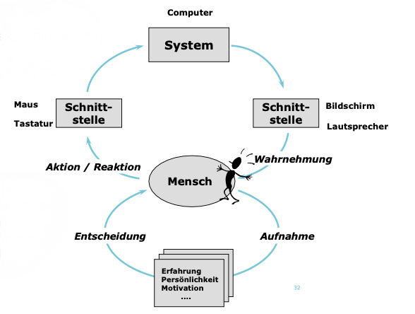

# Human Factors in Digital Design

- [Human Factors in Digital Design](#human-factors-in-digital-design)
  - [What are human factors?](#what-are-human-factors)
  - [Psychological Aspects](#psychological-aspects)
    - [Cognitive psychology](#cognitive-psychology)
    - [Memory](#memory)
    - [Attention](#attention)
    - [Learning](#learning)
    - [Motivation](#motivation)
    - [Behavioral change](#behavioral-change)
  - [Human Sensory Systems](#human-sensory-systems)
    - [Visual system](#visual-system)
    - [Auditive system](#auditive-system)
    - [Tactile system](#tactile-system)
    - [Vestibular system](#vestibular-system)
    - [Olfactory system](#olfactory-system)
    - [Gustatory system](#gustatory-system)
    - [Thermoreception](#thermoreception)
    - [Nociception](#nociception)
    - [Proprioception](#proprioception)
  - [Design Principles and Practices](#design-principles-and-practices)
    - [Laws of UX](#laws-of-ux)
    - [Color](#color)
    - [Communication](#communication)
    - [Animation](#animation)
    - [Interaction design patterns](#interaction-design-patterns)
    - [Accessibility](#accessibility)
    - [Design of everyday things](#design-of-everyday-things)
  - [Digital Design Challenges](#digital-design-challenges)
    - [Mobile](#mobile)
    - [Dark patterns](#dark-patterns)
    - [Hardware](#hardware)

## What are human factors?

In its essence, when talking about human factors in digital design, we want to improve the human – system interaction, considering all the aspects of the human system. Differentiation human factors from ergonomics, user experience, usability and human centered design is difficult as they all play into each other. They however share that the human is at the center of the design process. We take the humans abilities, needs, desires, ideas and requirements into account. By having these in mind, we better know how humans think and interact. We also know their limitations and then can derive certain insights into the design of interactive systems. This enables us to optimize the interaction of a human – system interface and leads to simpler operation as well as better usability and user experience.
Human factors are present in many fields such as: psychology, engineering, industrial design, physiology, anthropometry, security, social influencing factors, cognitive abilities, cooperation, problem solving.

Interaction always happens with the human(user) which has a certain task to fulfill with a system that is embedded in an environment.

The graphic below illustrates what plays into the human – system interaction.

---

## Psychological Aspects

These topics deal with the mental processes that influence how users interact with digital products. They are essential for understanding user behavior, preferences, and decision-making.

### Cognitive psychology

This section covers how we perceive information, how we can add structure, how to tell stories and what cognitive biases we have.

> [Cognitive psychology](cognitive-psychology)

### Memory

This section covers the long- and short-term memory and how we remember things and how to use this knowledge for creating interfaces.

> [Memory](memory)

### Attention

This section covers properties and types of attention, how colors grab attention and attention in relation to processing information.

> [Attention](attention)

### Learning

This section covers what learning is, what it involves and how it works. It also explores important derivations for design and gamification.

> [Learning](learning)

### Motivation

This section covers the motivation of users and how we get to know it.

> [Motivation](motivation)

### Behavioral change

This section how habits are formed and how to achieve long term habits.

> [Behavioral change](behavioral-change)

## Human Sensory Systems

These topics focus on how human sensory systems impact the way users experience and interact with digital environments, covering sight, sound, touch, balance, and other senses.

### Visual system

This section covers the basics of our visual system and design considerations for the visual system.

> [Visual system](visual-system)

### Auditive system

This section covers the basics of hearing, its limitation and derivations for design.

> [Auditive system](auditive-system)

### Tactile system

This section covers how the sense of touch works, its impairments and derivations for design.

> [Tactile system](tactile-system)

### Vestibular system

This section covers how the sense of balance works, provides examples and derivations for design.

> [Vestibular system](vestbular-system)

### Olfactory system

This section covers how the sense of smell works, provides examples and derivations for design.

> [Olfactory system](olfactory-system)

### Gustatory system

This section covers how the sense of taste works, provides examples and derivations for design.

> [Gustatory system](gustatory-system)

### Thermoreception

This section covers how the sense of temperature works, provides examples and derivations for design.

> [Thermoreception](thermoreception)

### Nociception

This section covers how the sense of pain works, provides examples and derivations for design.

> [Nociception](nociception)

### Proprioception

This section covers how the sense of body movement works, provides examples and derivations for design.

> [Nociception](nociception)
   

## Design Principles and Practices

These are core principles and practices in user experience (UX) design, which aim to create user-friendly and inclusive designs that cater to the needs of users.

### Laws of UX

This section covers the laws of UX which help to structure content, make interaction easier and more meaningful when designing.

> [Laws of UX](laws-of-ux)

### Color

This section describes that color in our interfaces should be chosen carefully by taking into account impairments and cultural contexts.

> [Color](color)

### Communication

This section covers the basics of communcation, how to provide feedback and how to improve communication.

> [Communication](communication)

### Animation

This section covers how animations can improve the user experience.

> [Animation](animation)

### Interaction design patterns

This section cover common ui patterns, minimal viable product, minimal lovable product and usability patterns

> [Interaction design patterns](interaction-design-patterns)

### Accessibility

This section covers why and how we can make interfaces accessible to many different user groups.

> [Accessibility](accessibility)

### Design of everyday things

This section the conceptual model, affordances, signifiers, mappings and feedback which are essential for designing everyday things.

> [Design of everyday things](design-of-everyday-things)

## Digital Design Challenges

These topics address challenges faced by designers in the digital realm, such as ethical concerns (dark patterns), mobile-specific design constraints, and the influence of hardware in shaping user interactions.

### Mobile

This section covers how users use mobile phones and best practices about mobile phone interaction.

> [Mobile](mobile)

### Dark patterns

This section describes patterns that are often applied, but are unfriendly to the user.

> [Dark patterns](dark-patterns)

### Hardware

This section covers the basics of hardware, how to use a humand-centered design process for hardware design and other design considerations for hardware.

> [Hardware](hardware)

