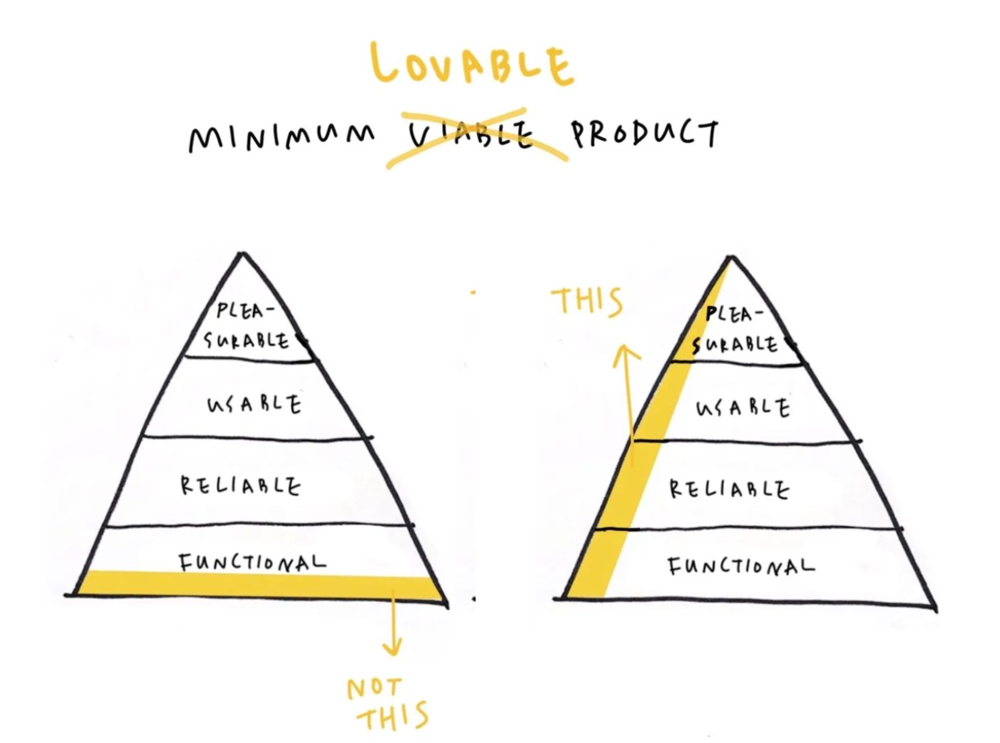

# Interaction design patterns

User Interface Design patterns are recurring solutions that solve common design problems.

---

- [Interaction design patterns](#interaction-design-patterns)
  - [UI patterns](#ui-patterns)
  - [Atomic design](#atomic-design)
  - [Minimal viable/lovable product](#minimal-viablelovable-product)
  - [5 Key Principles of Usability](#5-key-principles-of-usability)

---

## UI patterns

> See: [ui-patterns.com - Patterns](https://ui-patterns.com/patterns)

---

## Atomic design

Atomic Design is a methodology introduced by Brad Frost for creating design systems by breaking down user interfaces into five hierarchical levels:

- **Atoms**: The most basic elements, such as buttons, input fields, labels, colors, and fonts.

- **Molecules**: Combinations of atoms forming simple components, like a search form composed of a label, input field, and button.

- **Organisms**: Complex components made up of molecules and/or atoms, such as a website header that includes navigation, a logo, and a search form.

- **Templates**: Page-level structures that define the layout by arranging organisms, providing a framework for content placement.

- **Pages**: Specific instances of templates populated with real content, representing the final UI ready for user interaction.

This approach promotes consistency and reusability in design, enabling teams to construct interfaces systematically from simple to complex elements.

> See: [bradfrost.com - Atomic Web Design](https://bradfrost.com/blog/post/atomic-web-design/)

---

## Minimal viable/lovable product

The **Minimal Lovable Product (MLP)** is about starting small but creating something that users can enjoy and find valuable right away. Instead of trying to build the full product at the start, you focus on delivering a smaller version that is functional and worth loving.

This is different from a **Minimal Viable Product (MVP)**, which focuses on just the basic features to test an idea. The MLP adds an extra layer of care—making sure the product looks good, feels smooth to use, and brings joy to users, even if it’s simple.

For example, if you’re creating a photo-sharing app, an MVP might just let users upload and share photos. An MLP would do that too but could also include fun photo filters and a sleek design that makes the app feel special.

By creating something lovable early on, the MLP helps you build excitement, trust, and loyalty from users, which is a great starting point for improving the product over time.

---

## 5 Key Principles of Usability  

1. **Effective**: How well the product helps users achieve their goals accurately and completely.  
2. **Efficient**: How quickly users can complete their tasks.  
3. **Engaging**: How enjoyable and satisfying the product is to use.  
4. **Error Tolerant**: How well the product prevents mistakes and helps users recover if they do make an error.  
5. **Easy to Learn**: How quickly and easily users can understand and get started with the product, and how well it supports learning over time.  

Not all of these principles are equally important for every product. For example:  
- A **medical surgery interface** prioritizes **error tolerance**, **efficiency**, and **effectiveness** because mistakes can have serious consequences.  
- A **children's game**, however, must focus on being **easy to learn** and **engaging** to keep kids interested and entertained.  

Designers should consider which principles matter most based on the product's purpose and audience.