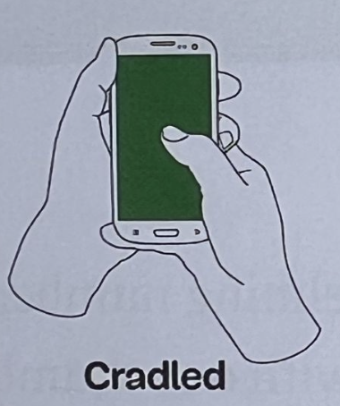
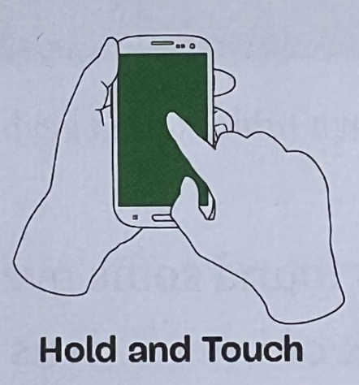
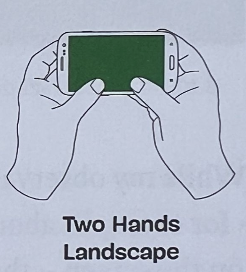
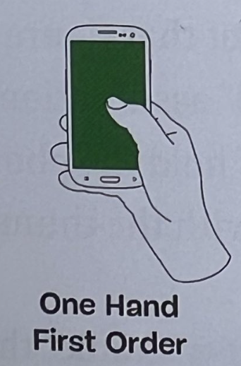
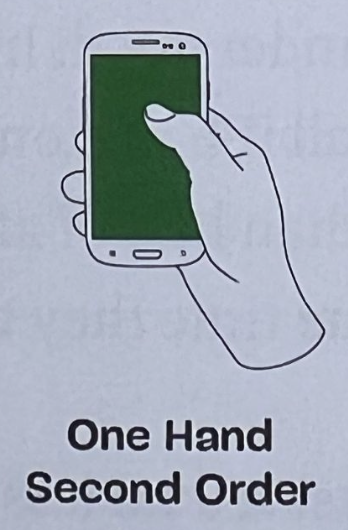
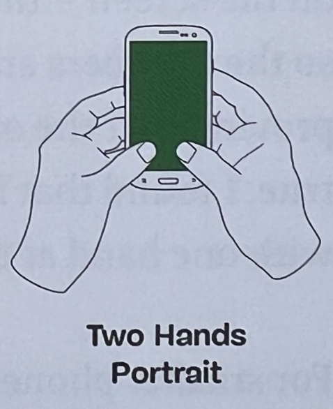
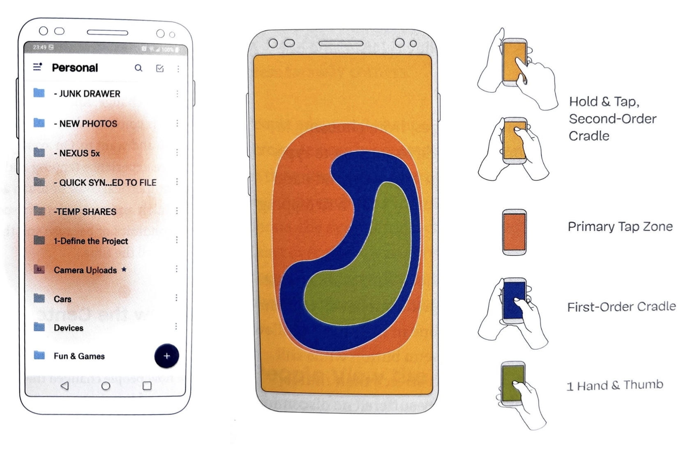

# Mobile
Designing for mobile is very important as more than 60% of todays web-interactions happen through a mobile interface.

---

- [Mobile](#mobile)
  - [How people interact with mobile phones](#how-people-interact-with-mobile-phones)
  - [Best practices for designing for mobile](#best-practices-for-designing-for-mobile)

---

## How people interact with mobile phones
Mobile phones are often interacted with the thumb, which can move one dimensional on a flat surface. However, an interaction with a single hand and a thumb does not happen often.
There are many more ways to interact with a mobile phone, which can be divided into six main ways:

|                                                                               |                                                                                 |                                                                                        |
| ----------------------------------------------------------------------------- | ------------------------------------------------------------------------------- | -------------------------------------------------------------------------------------- |
|                |    |  |
|  |  |               |

Mobile phones have areas, where people touch most of the time and what they use to way they use to touch.

Most users are most accurate at the center of the screen and accuracy decreases on the corners of the screen. This leads to the conclusion that it is better to size up elements which are at the corners of the screen.

---

## Best practices for designing for mobile
> Do not overwhelm the user with information. Deliver your value proposition step by step and allow the user to discover it.

> Provide navigation that is easy to use and makes sense to the user. Provide multiple ways to explore your content like search, categories or providing navigation through the content of the page.